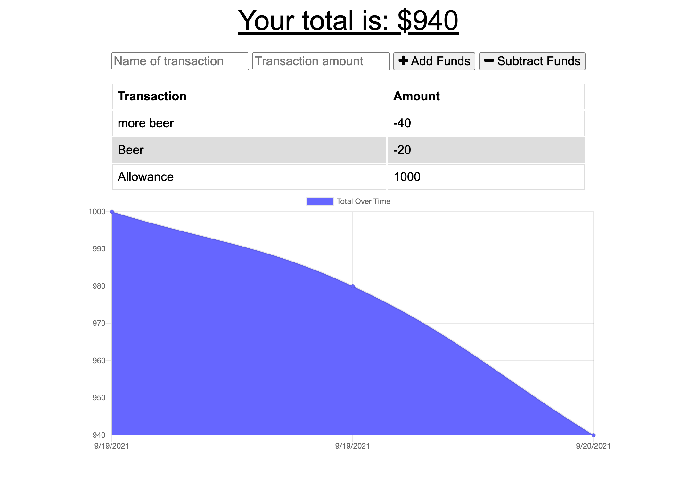

# Progressive-Budget
# Description

This application is used to keep track of your budget. This budget tracker can be used offline as well!
# Table of Contents

* [Installation](#installation)
* [Usage](#usage)
* [Technology](#technology)
* [Features](#features)
* [Contribution](#contribution)
* [Questions](#questions)

# Deployed Website: 
[Deployed Site](https://hidden-atoll-46530.herokuapp.com/)

# Screenshot :

|


# User Story

```
AS AN avid traveller

I WANT to be able to track my withdrawals and deposits with or without a data/internet connection

SO THAT my account balance is accurate when I am traveling
```
# Installation

1. Clone this repository to your local machine.

2. Run `npm install` to install dependencies required for this project.

3. Run `node server.js` to start the application.


# Usage

* Keep track of your spending.

* Be able to check your budget online as well as offline.

* You can add and subtract money from your budget.

# Technology

**1. [Mongoose]

**2. [Morgan]

**3. [Express.js]

**4. [Node.js]
# Features

1. Mongoose is used to create database for this application.

2. Express server is used to handle routing.

3. User can add and delete money from their budget.

4. Service-Worker is used to allow the application to be used while offline.

# Contribution

Please let me know how I can improve this project. Issues and pull requests are always welcome.

# Questions 

If you have any questions about the repo, 
contact me directly at [Email](mailto:josejrrosas@yahoo.com).